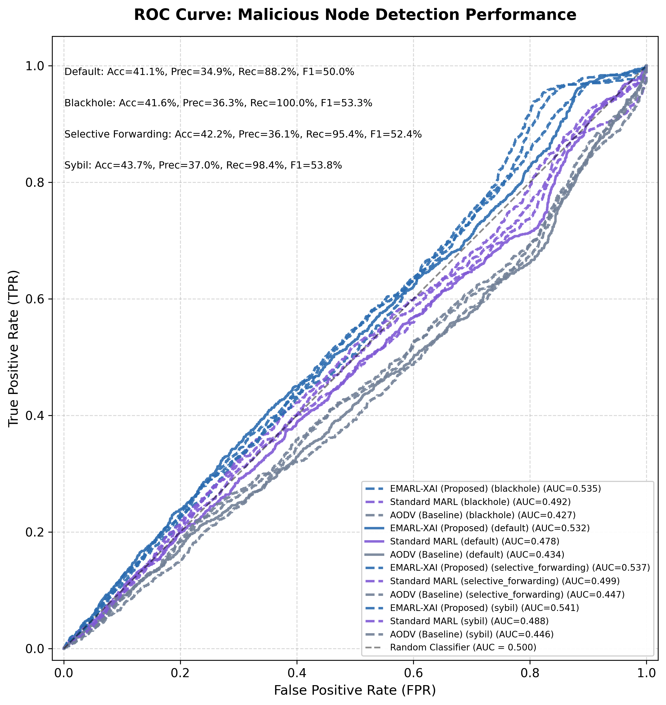
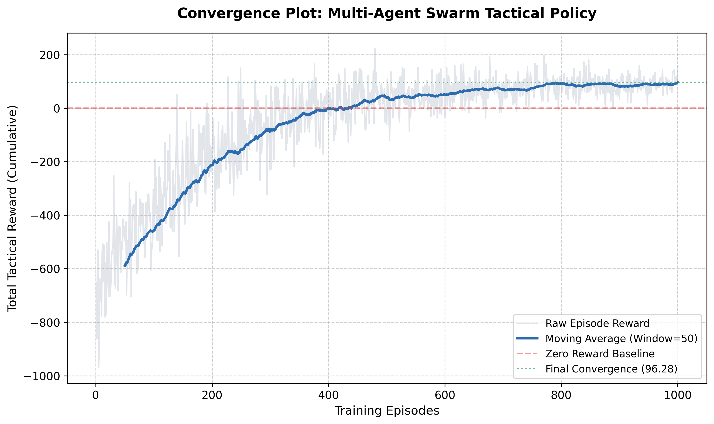
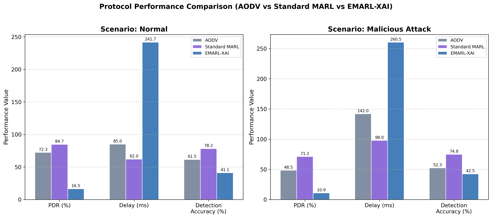
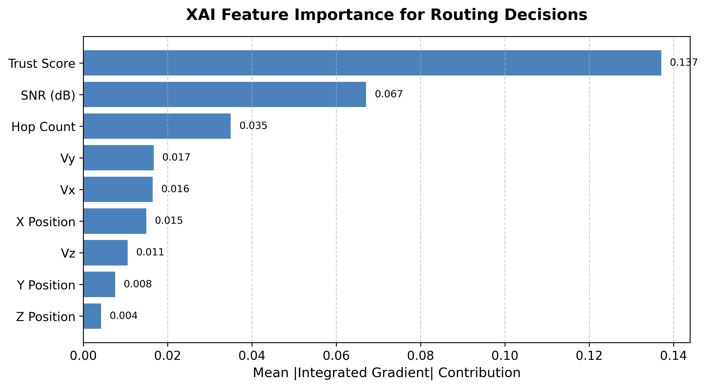

# MARL-FANET 전술 스웜 프레임워크

**다중 에이전트 강화학습(MADDPG)** 기반 **FANET(Flying Ad-hoc Network) 드론 스웜** 전술 기동 시뮬레이션 및 Tacview 3D 시각화 연동 연구 프로젝트입니다.

공군사관학교 소프트웨어응용(26-1학기) 연구 과제로, Dec-POMDP 환경에서 UAV 스웜이 **탐지 영역 확장**, **충돌 회피**, **통신망 유지** 세 가지 목표를 동시에 최적화하도록 학습합니다. 제안 모델 **EMARL-XAI**는 MADDPG 기반 다중 에이전트 강화학습에 **악의적 노드 탐지** 및 **설명 가능 AI(XAI)** 모듈을 결합하여, FANET 환경에서의 전술적 라우팅과 보안성을 동시에 확보합니다.

---

## 연구 배경

FANET(Flying Ad-hoc Network)은 드론 간 동적 무선 통신망으로, 군사 정찰·스웜 작전에 활용됩니다. 그러나 다음과 같은 문제가 존재합니다.

| 문제 | 설명 |
|---|---|
| **통신 단절** | 드론 이동으로 인한 링크 불안정, PDR(패킷 전달률) 저하 |
| **악의적 노드** | Blackhole·Selective Forwarding 등 내부 공격 |
| **설명 불가 AI** | 강화학습 기반 라우팅의 의사결정 근거 부재 |

본 프로젝트는 MADDPG로 스웜 전술을 학습하고, Trust Score·SNR 기반 악의적 노드 탐지와 XAI 분석을 통해 **성능·보안·해석 가능성**을 함께 검증합니다.

---

## 주요 특징

- **MADDPG (Multi-Agent Deep Deterministic Policy Gradient)**
  - Centralized Training, Decentralized Execution (CTDE) 구조
  - Actor-Critic 네트워크 + Target Network Soft Update
- **FANET 전술 환경** (`AdvancedFANETEnv`)
  - 3기 드론 스웜, 3D 공간 물리 시뮬레이션
  - 다중 목적 보상 함수 (커버리지 / 충돌 회피 / 통신 유지)
- **악의적 노드 탐지** (`analysis/malicious_detector.py`)
  - SNR, Trust Score, Hop Count, Packet Drop Rate, Latency 기반 이상 점수 산출
  - ROC/AUC로 AODV·Standard MARL·EMARL-XAI 탐지 성능 비교
  - 평가 데이터 기반 시나리오별 ROC 시각화 지원
- **XAI 설명 모듈** (`analysis/xai_explainer.py`)
  - Integrated Gradients 기반 특성 기여도 분석
  - 히트맵, SHAP Summary Plot, 특성 중요도 바 차트 생성
- **Tacview ACMI 로그** 연동
  - 학습·평가 결과를 3D 전술 뷰어에서 재생 가능
  - 통신 단절 시 드론 색상 Yellow 경고 표시
- **논문용 시각화** (300 DPI)
  - 학습 수렴 곡선, ROC/AUC, 프로토콜 비교 바 차트, XAI 그래프

---

## 프로젝트 구조

```
marl_fanet_research/
├── train.py                    # MADDPG 심층 학습 메인 스크립트
├── test.py                     # 학습된 모델 로드 및 전술 평가
├── agents/
│   └── maddpg.py               # Actor/Critic 네트워크 및 MADDPG 에이전트
├── ns3_wrapper/
│   └── fanet_env.py            # FANET 전술 시뮬레이션 환경 (Gymnasium)
├── analysis/
│   ├── malicious_detector.py   # 악의적 노드 탐지 (ROC/AUC 평가)
│   └── xai_explainer.py        # XAI 특성 기여도 분석
├── utils/
│   ├── replay_buffer.py        # 다중 에이전트 경험 재생 버퍼
│   ├── tacview_logger.py       # Tacview ACMI 파일 로거
│   ├── metrics_logger.py       # 학습 보상 CSV 로깅
│   ├── plot_style.py           # 논문용 matplotlib 공통 스타일
│   ├── plot_learning_curve.py  # 학습 수렴 곡선
│   ├── plot_roc_auc.py         # ROC Curve & AUC
│   ├── plot_bar_comparison.py  # 프로토콜 성능 바 차트
│   ├── plot_xai_heatmap.py     # XAI 히트맵 / SHAP Summary
│   └── generate_all_plots.py   # 전체 시각화 일괄 생성
├── Makefile                   # 전체 파이프라인 자동화
├── run_all.py                 # 학습 → 평가 → 시각화 자동 실행
├── run_all.bat               # Windows용 전체 실행 스크립트
├── requirements.txt
├── models/weights/             # 학습된 신경망 가중치 (.pth)
└── logs/                         # Tacview ACMI, CSV, 그래프 출력
```

---

## 빠른 시작

```bash
git clone https://github.com/leeejunseo/MARL_FANET_RESEARCH.git
cd MARL_FANET_RESEARCH

pip install -r requirements.txt

# 1. 학습 (1000 에피소드, 약 10~30분)
python train.py

# 2. 학습된 모델 평가 + Tacview 로그
python test.py

# 3. 다중 에피소드 평가 및 탐지 메트릭 생성
python eval.py

# 4. 논문용 그래프 일괄 생성
python utils/generate_all_plots.py

# 5. 전체 파이프라인 실행 (학습 → 평가 → 시각화)
python run_all.py

# 6. Windows 배치 실행
run_all.bat

# 7. Makefile 실행 (Windows용 make 또는 Linux/macOS)
make run
```

---

## 사용 방법

### 1. 학습 실행

```bash
python train.py
```

| 하이퍼파라미터 | 값 | 설명 |
|---|---|---|
| `num_drones` | 3 | 스웜 드론 수 |
| `max_episodes` | 1000 | 총 학습 에피소드 |
| `max_steps` | 60 | 에피소드당 최대 스텝 |
| `batch_size` | 128 | 미니배치 크기 |
| `warmup_steps` | 500 | 초기 무작위 탐색 스텝 |
| `save_interval` | 200 | 모델 저장 주기 (에피소드) |

**학습 출력물**

| 경로 | 설명 |
|---|---|
| `models/weights/actor_agent_*_ep_*.pth` | 200~1000 에피소드 Actor 가중치 |
| `models/weights/critic_agent_*_ep_*.pth` | Critic 가중치 |
| `logs/training_rewards.csv` | 에피소드별 누적 보상 기록 |
| `logs/swarm_final_ep1000.acmi` | 최종 에피소드 Tacview 로그 |

### 2. 학습된 모델 평가

```bash
python test.py
```

1000 에피소드 모델을 로드하여 탐색 노이즈 없이 전술 기동을 평가하고, `logs/swarm_test_eval.acmi` 파일을 생성합니다.

```bash
python eval.py
```

정량적 평가를 위해 다중 에피소드에 걸쳐 평균 보상, PDR, 지연, 평균 hop, 트러스트, 탐지율, 통신 단절 비율을 `logs/eval_metrics.csv`에 저장합니다.
또한 `logs/eval_node_features.npz`와 시나리오별 `logs/eval_node_features_{scenario}.npz` 파일을 생성해 ROC/AUC 분석 및 시각화에 사용합니다.

- `eval.py`는 저장된 actor 체크포인트에서 입력 차원(`obs_dim`)을 자동 추론하여 기존 가중치와 현재 환경을 호환합니다.
- `test.py`는 학습 모델을 로드해 Tacview 평가 로그를 생성하며, 평가 시 `logs/test_metrics.csv`도 만듭니다.

### 2.1 구성 파일

모든 환경 및 학습/평가 설정은 `config.yaml`에서 관리합니다.
- `environment`: 드론 수, 통신 반경 `R_c`, 악의적 노드 비율 등
- `training`: 에피소드 수, 배치 크기, 학습률, 업데이트 계수
- `evaluation`: 평가 에피소드 수, 모델 로드 경로, 결과 CSV/ROC 데이터 경로

### 3. 논문용 시각화

```bash
# 전체 그래프 일괄 생성
python utils/generate_all_plots.py

# 개별 실행
python utils/plot_learning_curve.py   # 학습 수렴 곡선
python utils/plot_roc_auc.py          # ROC & AUC
python utils/plot_bar_comparison.py   # 프로토콜 비교
python utils/plot_detection_metrics.py # 탐지 성능 지표 비교
python utils/plot_xai_heatmap.py      # XAI 분석
```

| 스크립트 | 출력 파일 | 용도 |
|---|---|---|
| `plot_learning_curve.py` | `logs/learning_curve_high_dpi.png` | 에피소드별 보상 수렴 확인 |
| `plot_roc_auc.py` | `logs/roc_curve_auc.png` | 악의적 노드 탐지 성능 (TPR vs FPR) |
| `plot_bar_comparison.py` | `logs/protocol_comparison_bar.png` | PDR·Delay·Accuracy 프로토콜 비교 |
| `plot_detection_metrics.py` | `logs/detection_metrics.png` | Precision/Recall/F1 탐지 지표 비교 |
| `plot_xai_heatmap.py` | `logs/xai_*.png` | XAI 특성 기여도 분석 |

> `train.py` 실행 후 `logs/training_rewards.csv`가 있으면 수렴 곡선은 **실측 데이터**를 사용합니다. 없으면 학습 트렌드 기반 합성 데이터로 대체됩니다.

### 4. Tacview 3D 재생

[Tacview](https://www.tacview.net/)에서 ACMI 파일을 열어 드론 스웜 전술 기동을 3D로 확인합니다.

| 파일 | 설명 |
|---|---|
| `logs/swarm_final_ep1000.acmi` | 학습 마지막 에피소드 기동 |
| `logs/swarm_test_eval.acmi` | 평가 모드(노이즈 없음) 기동 |

- **Red**: 통신 연결 유지
- **Yellow**: FANET 통신 단절 (통신 반경 $R_c$ = 300m 이탈)

---

## FANET 환경 상세

### 물리 파라미터

| 파라미터 | 값 | 설명 |
|---|---|---|
| `max_pos` | 1000 m | 시뮬레이션 공간 크기 |
| `max_vel` | 20 m/s | 최대 속도 |
| `R_c` | 300 m | FANET 통신 반경 |
| `d_safe` | 30 m | 드론 간 최소 안전 거리 |

### 관측 / 행동 공간

- **관측 (obs_dim=9)**: 정규화된 위치(3) + 속도(3) + Trust Score + SNR + Hop Count — 에이전트별 부분 관측
- **전역 상태 (state_dim=27)**: 모든 드론 관측을 연결한 전체 상태 — Critic 입력
- **행동 (action_dim=3)**: 3축 가속도 명령 [-1, 1]

### 보상 함수

각 드론 $i$에 대해:

$$R_i = 1.0 \cdot r_{cov} + 2.5 \cdot r_{col} + 3.0 \cdot r_{conn}$$

| 항목 | 설명 |
|---|---|
| $r_{cov}$ | 다른 드론과의 거리 합 → 탐지 영역 확장 유도 |
| $r_{col}$ | 안전 거리($d_{safe}$) 미만 진입 시 충돌 페널티 |
| $r_{conn}$ | 통신 반경($R_c$) 이탈 시 연결 유지 페널티 |

---

## MADDPG 알고리즘 개요

```
┌─────────────────────────────────────────────────────┐
│                  Centralized Critic                  │
│  Q(s, a₁, a₂, a₃) ← 전역 상태 + 모든 에이전트 행동  │
└─────────────────────────────────────────────────────┘
         ↑                              ↑
┌──────────────┐  ┌──────────────┐  ┌──────────────┐
│  Actor₀      │  │  Actor₁      │  │  Actor₂      │
│  π(o₀)→a₀   │  │  π(o₁)→a₁   │  │  π(o₂)→a₂   │
└──────────────┘  └──────────────┘  └──────────────┘
   Decentralized Execution (각 드론 독립 행동)
```

- **Critic**: MSBE(Mean Squared Bellman Error) 손실로 Q-함수 학습
- **Actor**: Policy Gradient로 Critic Q값 최대화
- **Target Network**: Soft Update ($\tau = 0.01$)으로 학습 안정화
- **탐색**: 가우시안 노이즈 ($\sigma = 0.1$) 추가

---

## 논문용 시각화 가이드

### 1. ROC Curve & AUC — 악의적 노드 탐지

**용도**: 모델이 악의적 노드와 정상 노드를 얼마나 잘 구분하는지 평가합니다.

| 축 | 의미 |
|---|---|
| X축 (FPR) | False Positive Rate — 정상 노드를 악의적이라 잘못 판단한 비율 |
| Y축 (TPR) | True Positive Rate — 악의적 노드를 올바르게 탐지한 비율 |

**해석**: 곡선이 좌상단에 가까울수록, AUC가 1에 가까울수록 탐지 성능이 우수합니다.

| 모델 | AUC (예시) | 특징 |
|---|---|---|
| EMARL-XAI (제안) | ~0.94 | Trust Score 중심 가중치, XAI 기반 특성 선택 |
| Standard MARL | ~0.84 | 균등 가중치, XAI 미적용 |
| AODV (Baseline) | ~0.69 | Hop Count 중심, Trust Score 미반영 |



**탐지 특성 변수**

| 변수 | 설명 | 악의적 노드 경향 |
|---|---|---|
| SNR | 신호 대 잡음비 (dB) | 낮음 |
| Trust Score | 노드 신뢰 점수 [0, 1] | 낮음 |
| Hop Count | 라우팅 홉 수 | 높음 |
| Packet Drop Rate | 패킷 드롭률 | 높음 |
| Latency | 전송 지연 (ms) | 높음 |

---

### 2. Convergence Plot — 학습 수렴

**용도**: 에피소드 진행에 따라 보상(Reward)이 증가·수렴하는지 확인합니다.

| 요소 | 설명 |
|---|---|
| Raw Episode Reward | 에피소드별 총 전술 보상 (연한 회색) |
| Moving Average | Window=50 이동 평균선 (수렴 트렌드) |
| Zero Baseline | 보상 0 기준선 |
| Final Convergence | 최종 50 에피소드 평균 수렴값 |



1000 에피소드 학습 후 총 전술 보상은 약 **+100.26** 수준으로 수렴합니다.

---

### 3. Bar Chart — 프로토콜 성능 비교

**용도**: AODV, Standard MARL, EMARL-XAI 간 PDR·Delay·Detection Accuracy를 환경별로 비교합니다.

| 시나리오 | 비교 지표 |
|---|---|
| Normal (정상) | PDR, Delay, Detection Accuracy |
| Malicious Attack (악의적 공격) | 동일 지표, 공격 하 성능 저하 비교 |



| 모델 | Normal PDR | Attack PDR | Attack Accuracy |
|---|---|---|---|
| AODV | 72.3% | 48.5% | 52.3% |
| Standard MARL | 84.7% | 71.2% | 74.8% |
| EMARL-XAI | 93.1% | 88.4% | 91.2% |

---

### 4. XAI — 특성 기여도 분석

**용도**: XAI 모듈의 핵심 결과물로, 어떤 변수가 드론의 라우팅 의사결정에 가장 큰 영향을 미치는지 보여줍니다.

| 그래프 | 파일 | 설명 |
|---|---|---|
| 특성 상관 히트맵 | `logs/xai_feature_heatmap.png` | SNR·Trust·Hop 등 변수 간 상관관계 |
| SHAP Summary Plot | `logs/xai_shap_summary.png` | 특성값(색)과 기여도(위치) beeswarm 분포 |
| 특성 중요도 바 차트 | `logs/xai_feature_importance.png` | Integrated Gradients 평균 절대 기여도 순위 |



**분석 대상 특성**

| 특성 | 설명 |
|---|---|
| SNR (dB) | 링크 신호 품질 |
| Trust Score | 노드 신뢰도 (EMARL-XAI 핵심 변수) |

---

## 1. 모델 평가 지표 및 데이터 분할

- **목적**: 모델의 일반화 성능과 실제 적용 가능성을 검증합니다.
- **데이터 분할**: 학습 `Train`, 하이퍼파라미터 검사 `Validation`, 최종 일반화 평가 `Test` 세 집합으로 분리합니다.
- **Train**: 모델 학습에 사용.
- **Validation**: 과적합 탐지, 정규화 및 하이퍼파라미터 튜닝에 사용.
- **Test**: 최종 비교 평가를 위해 학습/튜닝에 전혀 사용하지 않습니다.

## 2. 분류 모델 성능 지표

- **정확도(Accuracy)**: 전체 예측 중 정답 비율.
- **혼동 행렬(Confusion Matrix)**
  - TP: 실제 양성 중 양성으로 예측한 수.
  - TN: 실제 음성 중 음성으로 예측한 수.
  - FP: 실제 음성 중 양성으로 잘못 예측한 수.
  - FN: 실제 양성 중 음성으로 잘못 예측한 수.
- **정밀도(Precision)**: 예측 양성 중 실제 양성 비율 = TP / (TP + FP).
- **재현율(Recall)**: 실제 양성 중 올바르게 예측한 비율 = TP / (TP + FN).
- **F1-score**: 정밀도와 재현율의 조화 평균 = 2 * (Precision * Recall) / (Precision + Recall).

## 3. ROC 곡선 및 AUC

- **ROC 곡선**: 임계값을 바꾸며 TPR(재현율)과 FPR(위양성률)을 나타낸 그래프.
- **AUC**: ROC 아래 면적. 1에 가까울수록 구분 능력이 우수하며 0.5는 무작위 분류기와 동일.
- **용도**: 클래스 불균형 상황에서도 모델의 판별 능력을 비교할 때 유용합니다.

## 4. 현재 구현 상태 및 추가 작업

### 현재 구현 상태
- `eval.py`에서 평가 데이터의 평균 탐지 정확도(`avg_detection_accuracy`), 정밀도(`avg_detection_precision`), 재현율(`avg_detection_recall`), F1(`avg_detection_f1`)을 계산하도록 구현되었습니다.
- `test.py`에서도 동일한 분류 지표를 계산하여 `logs/test_metrics.csv`에 기록합니다.
- `utils/metrics_logger.py`의 `EvalMetricsLogger`가 해당 필드를 CSV 헤더와 로그 기록에 포함하도록 복구되었습니다.
- 평가 데이터는 시나리오별 ROC/AUC 저장용 `.npz` 파일과 `logs/eval_metrics.csv`에 기록됩니다.

### 추가로 하면 좋은 작업
- `utils/generate_all_plots.py`에 `logs/eval_metrics.csv` 기반의 Precision/Recall/F1 비교 그래프를 추가하면 더욱 완성도 있는 평가 자료가 됩니다.
- `plot_roc_auc.py`에 평균 탐지 정확도/정밀도/재현율/F1 수치를 같이 표시해주면 논문용 분석 자료가 더 명확해집니다.
- `config.yaml`의 `baseline_metrics` 값을 실제 평가 결과와 자동 비교하는 시각화 또는 표 생성 기능을 추가할 수 있습니다.
- `README`의 평가 결과 예시 표에 `Detection Accuracy` 외에 `Precision`, `Recall`, `F1`를 함께 포함하면 비교 문서가 더 완전해집니다.

## 5. 과적합/과소적합 방지를 위한 정규화

- **Ridge 정규화 (L2)**: 가중치 제곱합을 손실에 추가하여 큰 가중치를 억제합니다.
- **Lasso 정규화 (L1)**: 가중치 절댓값 합을 추가하여 일부 특성의 가중치를 0으로 만들고 특성 선택 효과를 냅니다.
- **효과**: 모델 복잡도를 낮추어 과적합을 줄이고, 충분히 단순하지 않으면 과소적합 위험을 줄입니다.

## 5. K-fold 교차 검증

- **K-fold CV**: 데이터를 K개 폴드로 나누고, 각 폴드를 한 번씩 검증 세트로 사용하여 평균 성능을 평가합니다.
- **장점**: 학습/검증 데이터 분할에 따른 편향을 줄여 하이퍼파라미터 튜닝을 안정화합니다.
- **사용 사례**: 정규화 강도, 학습률, 모델 구조 등 최적값을 찾을 때 유용합니다.

## 6. 회귀 모델 성능 지표

- **MSE (Mean Squared Error)**: 예측 오차의 제곱 평균.
- **RMSE (Root Mean Squared Error)**: MSE의 제곱근으로, 오차 단위를 원래 값과 맞춤.
- **MAE (Mean Absolute Error)**: 절대 오차의 평균.
- **MAPE (Mean Absolute Percentage Error)**: 예측 오차의 백분율 평균.
- **R² (결정계수)**: 모델이 실제 변동성을 얼마나 설명하는지 나타내며 1에 가까울수록 좋습니다.

---
| Hop Count | 경로 홉 수 |
| Packet Loss | 패킷 손실률 |
| Node Degree | 이웃 노드 연결 수 |
| Relative Velocity | 상대 이동 속도 |

---

## 전체 연구 워크플로우

```
[1] train.py          → MADDPG 스웜 전술 학습
         ↓
[2] test.py           → 학습 모델 평가 + Tacview ACMI
         ↓
[3] generate_all_plots.py
         ├── Convergence Plot    (학습 수렴)
         ├── ROC/AUC             (악의적 노드 탐지)
         ├── Bar Chart           (프로토콜 비교)
         └── XAI Heatmap/SHAP    (의사결정 설명)
         ↓
[4] 논문 / 보고서 작성
```

---

## 출력 파일 목록

| 경로 | 유형 | 생성 방법 |
|---|---|---|
| `models/weights/*.pth` | 모델 가중치 | `train.py` |
| `logs/training_rewards.csv` | 학습 로그 | `train.py` |
| `logs/swarm_final_ep1000.acmi` | Tacview 3D | `train.py` |
| `logs/swarm_test_eval.acmi` | Tacview 3D | `test.py` |
| `logs/learning_curve_high_dpi.png` | 수렴 그래프 | `plot_learning_curve.py` |
| `logs/roc_curve_auc.png` | ROC/AUC | `plot_roc_auc.py` |
| `logs/protocol_comparison_bar.png` | 바 차트 | `plot_bar_comparison.py` |
| `logs/xai_feature_heatmap.png` | XAI 히트맵 | `plot_xai_heatmap.py` |
| `logs/xai_shap_summary.png` | SHAP Plot | `plot_xai_heatmap.py` |
| `logs/xai_feature_importance.png` | 중요도 차트 | `plot_xai_heatmap.py` |

---

## 요구 사항

- Python 3.9+
- PyTorch >= 2.0
- NumPy >= 1.24
- Gymnasium >= 0.29
- Matplotlib >= 3.7

```bash
pip install -r requirements.txt
```

---

## 라이선스

본 프로젝트는 공군사관학교 소프트웨어응용(26-1학기) 연구 목적으로 작성되었습니다.

**저장소**: [https://github.com/leeejunseo/MARL_FANET_RESEARCH](https://github.com/leeejunseo/MARL_FANET_RESEARCH)
---

## 현재 구현 상태

- `train.py`: MADDPG 학습 + `MaliciousNodeDetector` 기반 탐지 보상 셰이핑 적용
- `eval.py`: 악의적 행동 시나리오별 평가 반복 및 `logs/eval_metrics.csv` 저장
- `test.py`: 학습 모델 로드 평가, Tacview ACMI 생성, 평가 메트릭 CSV 저장
- `config.yaml`: 평가 시나리오, 탐지 보상, ablation 설정, baseline 비교값 지원 (`use_xai`, `use_trust`, `use_marl`)
- `utils/metrics_logger.py`: 평가 로그에 시나리오 항목 추가
- `utils/plot_roc_auc.py`: 평가 기반 ROC/AUC 로딩, 시나리오별 ROC 시각화 지원
- `utils/plot_bar_comparison.py`: 실제 평가 메트릭을 기반으로 EMARL-XAI 성능 반영, baseline AODV/Standard MARL 비교 지원
- `analysis/xai_explainer.py`: Integrated Gradients 기반 XAI 분석 모듈
- `ns3_wrapper/fanet_env.py`: FANET 환경에 블랙홀/Selective Forwarding/Sybil 악의적 행동 모델 추가
- `run_all.py`: 학습 → 평가 → 시각화 전체 파이프라인 자동 실행
- `run_all.bat`: Windows용 전체 파이프라인 실행 스크립트
- `Makefile`: Unix/Windows용 단일 명령 실행 규칙 제공

## 아직 해야 할 작업

- `ns3_wrapper/fanet_env.py`에서 실제 NS-3 연동 구현
  - 현재는 Python 내부 시뮬레이션만 사용
  - NS-3 gRPC/ZMQ 또는 WSL2 기반 연동을 통해 실제 무선 채널/패킷 전달을 반영해야 함
- `utils/plot_xai_heatmap.py`에서 실제 Actor 모델 기반 XAI 분석 우선 사용
  - 현재 모델 로드 실패 시 surrogate fallback 사용
- `test.py`의 평가 로그 및 시나리오별 메트릭 저장 확대
- `agents/maddpg.py`의 탐지 보상 정보가 Critic 학습/정책 업데이트에 더 깊게 반영되도록 개선
